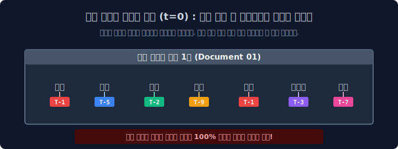

# 7.6 커닝의 미학: MCMC 방식의 깁스 샘플링(Gibbs) 통계 역추적 추론

현실 세계에서 기계는 모니터에 떠오르는 단어 텍스트($W$)를 쳐다본다고 해서 "아, 이거 옛날에 창조주가 76% 비율 주사위($\theta$)로 굴려 뽑은 단어네!" 하고 단번에 마법처럼 통신망을 역탐지하는 초능력 미적분 함수 같은 건 갖고 있지 않습니다. 대신 컴퓨터는 100만 번 책장을 덮고 스티커를 바꿔 붙이며 폭풍 커닝을 시전하는, 가장 무식하지만 완벽하게 정교한 통계 수렴 스킬인 **깁스 샘플링(Gibbs Sampling)**을 가동합니다.

---

## 7.6.1 깁스 샘플링 극초기의 무지성 난장판 부리기 

방정식 하나로 시원하게 딱 떨어지는 $x$ 값을 구하는 짓은 이 거대한 LDA 미적분 토픽 모델에서 기하학적으로 절대 불가능합니다. 
그래서 기계는 **MCMC (Markov Chain Monte Carlo)** 계열의 아주 뻔뻔한 "무한 반복 찍기 노가다" 훈련 방식을 베이스로 깝니다.

1.  **처음엔 그냥 막 갖다 붙이기 (Initialization 시간 $t=0$)**: 
    기계는 처음엔 분석할 의지도 없습니다. 1만 장의 문서 안에 박힌 모든 개별 단어 수십만 개 낱말 위에, 그냥 1번 토픽, 5번 토픽, 3번 토픽 **아무 스티커나 미친 듯이 엉망진창 랜덤으로 다 풀을 발라 붙여버립니다.**
2.  이때 붙여진 초기 상태는 정답과 100만 광년 동떨어진, 논리가 완전히 파괴된(예: `국회` $\to$ 스포츠 토픽) 완전한 쓰레기 오답 표찰입니다.

---

## 7.6.2 수렴할 때까지 무한 회전하는 지옥의 커닝 루프 

엉망진창 스티커가 다 발라지게 되면 끝이 아닙니다. 이제부터 인공지능 중앙 감찰관이 단어 하나하나를 순서대로 하나씩 콕 집어 붙잡고 면담을 하며 **스티커를 뜯고 새로 고쳐 붙이는** 길고 긴 고통의 사이클(Epoch)을 수만 번 무한 반복 회전시킵니다. "수렴(더 이상 단어들이 스티커를 안 바꿀 때)" 할 때까지 이 쳇바퀴 루프는 멈추지 않습니다.

> 감찰관이 랜덤 스티커(`정치 1번`)가 잘못 붙여진 어떤 억울한 단어 `[사과]` 하나를 골라서 다그칩니다. 
> *"야 단어 스펠링아, 너 임마 진짜 고향 원래 정답 토픽표가 어딘지 까먹었지? 자, 내가 눈 한 번 감아줄 테니까 지금 당장 네 주변 좌우 동네 분위기 좀 쭉 훑어보고(커닝) 눈치껏 확률적으로 제일 정답 같은 토픽 스티커 하나 주워다가 지금 당장 다시 갈아끼워라!"*

---

## 7.6.3 눈치 게임의 2가지 절대 커닝 잣대 방정식 (업데이트 룰)

기계는 저 단어 1개의 스티커를 떼어내고 새로 붙여줄 때, 그냥 느낌으로 고치는 게 아니라 수학적으로 기가 막힌 **2가지 주변 커닝 잣대 비율 지분율**을 곱셈으로 짬뽕시켜서 갈아치웁니다.

$$ P(z_i = k \mid z_{-i}, w) \propto \left( \frac{n_{m, k}^{(doc)}}{\text{문서 m의 전체 단어 수}} \right) \times \left( \frac{n_{k, w}^{(word)}}{\text{토픽 k의 전체 단어 수}} \right) $$

기계는 저 무시무시한 조건부 확률 최우도 수식을 통해 단어의 스티커를 새것으로 교체합니다. 이 공식의 알맹이는 소름 돋게도 우리 인간의 아주 단순한 "눈치 보기 인지상정" 본성과 일치합니다.

### 1. 커닝 잣대 1번: "내 문서 방에 같이 사는 동거인 형제 놈들은 지금 무슨 표찰표를 차고 있지?" (문서 내 지분율)
내가 살고 있는 `[문서 1번]` 종이 방 안에 나와 같이 단칸방을 쓰고 있는 룸메이트 다른 단어 형제들(`바나나`, `포도`, `달콤한`)을 쓱 쳐다봅니다.
이 형제놈들을 보니 압도적으로 **`[과일 토픽 스티커]`** 를 주렁주렁 달고 있습니다!
*   **단어의 변명**: *"헐.. 내 형제들이 싹 다 과일 밭이네? 그럼 나(`사과` 단어)도 지금 분위기상 뻘쭘하게 나 혼자 여기서 `[정치 토픽]` 스티커 고집부려 달고 있지 말고, 확률적으로 과일일 가능성이 압도적으로 높으니 저걸로 재빨리 갈아타야 방 분위기가 맞겠군!"*

### 2. 커닝 잣대 2번: "바깥 옆동네에 사는 내 스펠링 도플갱어 우주 친척들은 무슨 표찰표를 달았지?" (토픽 내 지분율)
하지만 동거인 형제들만 보고 확신하긴 여전히 불안합니다. 이번엔 내 1번 문서 방을 완전히 훌쩍 벗어나서, 저기 옆 동네 멀리 떨어진 `[문서 7번]`과 `[문서 55번]`에 흩어져 살고 있는 우주 전체의 진짜 나의 스펠링 분신 쌍둥이 단어 `사과` 들한테 무전기를 쳐 물어봤습니다. 
*"야 분신들아, 너희들 딴 동네에서 지금 무슨 토픽 표찰 달고 살아남았냐?"*
*   **분신들의 대답**: 저 바깥 동네 수천 개의 `사과` 스펠링 쌍둥이들도 놀랍게도 전부 다 **`[과일 토픽 스티커]`** 를 차고 있다고 무전이 옵니다!
*   **단어의 최종 확신**: *"아하! 이 `사과` 이란 스펠링 단어의 유전자 혈통 본성은 세상 어디 가든 태생부터 원래 100% `과일 토픽` 소속인 거구나! 자 당장 내 기존 스티커 뜯어버리고 과일 토픽으로 확정 땅땅땅!"*

---

## 7.6.4 노가다의 승리와 토픽 백과사전 역설계의 완성

이렇게 수십만 개의 단어 덩어리들이 수만 번의 긴 밤 에폭(Epoch) 동안, 서로서로 형제 단어 분위기 눈치 보고, 외부 쌍둥이 친척 눈치 보는 거대한 MCMC 확률 계산 커닝 루프장을 쉬지 않고 돕니다. 
결국 어느 순간 거대한 무리의 단어군이 **끼리끼리 완벽한 유전자 혈통으로 끈끈하게 결집하여 서로 안정화(수렴, Converge)** 되는 평화의 타이밍이 찾아오고, 여기서 모든 단어가 더 이상 "난 안 바꿀래~" 라며 토픽 스티커를 영원히 바꾸지 않을 때 학습 엔진이 쾅 하고 멈춥니다!

이 지옥의 10,000번 노가다 수렴이 끝났을 때 컴퓨터 메모리에 남겨진 최종 확률 엑셀 지분표 덩어리. 바로 그것이 **우리가 그렇게 역추적해서 까발리고 싶어 했던 원시 조물주(?) 가 은밀히 과거에 던졌던 전설의 `토픽 문서 룰렛 비율(세타)` 이며 `토픽방 스펠링 주머니 빈도(파이)` 인 것입니다!**

LDA의 등장으로 2010년대 "비지도 문서 토픽 모델링" 은 데이터 마이닝 학계의 최정점을 찍게 됩니다. 
하지만 결국 단어와 단어 사이의 유기적인 '문맥 구조'를 철저히 박살 내는 주머니(Bag of Words) 방식의 본질적 한계를 뼈저리게 느끼며, 학계는 이제 글의 앞뒤 맥락 자체를 통으로 이해해 버리는 **어텐션(Attention) 아키텍처와 트랜스포머 언어 모델 인공 뇌세포**의 시대로 거대한 패러다임 점프를 맞이하게 됩니다. 

*7주 차 파멸의 디리클레 룰렛과 깁스 샘플링 끝.*
